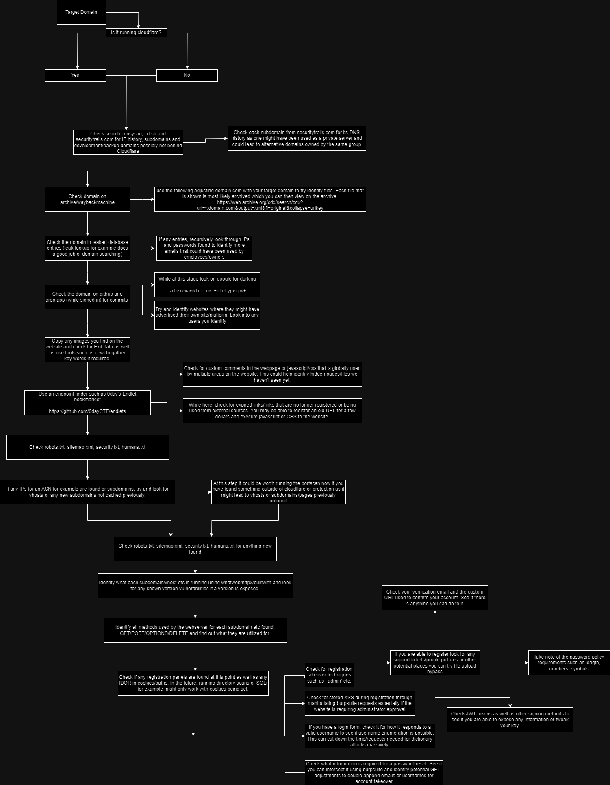

# Bug Bounty Process Flowchart

This repository contains a comprehensive flowchart outlining a structured approach to identifying, analyzing, and exploiting potential vulnerabilities in web applications, particularly those involving the bypass of security mechanisms such as Cloudflare.

## Process Overview

The process flowchart provides a step-by-step guide for conducting a bug bounty or penetration testing engagement. It details the necessary checks, tools, and methodologies required to effectively assess a target domain.

## Flowchart

Below is the visual representation of the process:

## Steps to Follow

### 1. Identify Target Domain
- **Objective:** Start by identifying the domain you wish to target for the security assessment.

### 2. Check for Cloudflare
- **If Yes:** 
  - Use tools like **SecurityTrails** to extract DNS records and subdomains that might be exposed outside of Cloudflare.
  - Investigate non-standard ports and services that could bypass Cloudflare protection.
- **If No:**
  - Directly enumerate subdomains using tools like **Sublist3r** or **Amass**.
  - Analyze DNS records from sources like **SecurityTrails** to identify the hosting provider.

### 3. Domain Analysis
- **Archive Analysis:** 
  - Use the Wayback Machine to explore historical versions of the site.
  - Focus on files like `robots.txt`, `sitemap.xml`, and older HTML files that might reveal sensitive directories or endpoints.

### 4. Source Code and Repository Analysis
- **GitHub and GitLab Analysis:**
  - Search for exposed credentials, API keys, or sensitive configurations using keywords like `.env` or `config`.
  - Review commits for potential leaks.

### 5. Website Fingerprinting
- **Technology Stack Identification:**
  - Identify the technologies used by the website (e.g., CMS, frameworks).
  - Check for known vulnerabilities associated with these technologies using tools like **WhatWeb** or **BuiltWith**.

### 6. Vulnerability Identification
- **Common Vulnerabilities:**
  - Look for SQL injections, Cross-Site Scripting (XSS), and file inclusion vulnerabilities.
  - Use automated scanners to assist in the initial detection of vulnerabilities.
  
### 7. Exploitation and Post-Exploitation
- **Exploitation:**
  - Use identified vulnerabilities to gain unauthorized access.
  - Focus on escalating privileges or further penetrating the network.
- **Post-Exploitation:**
  - Secure proof of concept for vulnerabilities found.
  - Document the steps clearly to replicate the exploitation.

### 8. Reporting
- **Responsible Disclosure:** 
  - Report the vulnerabilities to the target's security team or through a bug bounty platform.
  - Provide detailed descriptions, steps to replicate, and suggestions for remediation.

## Tools Used

- **SecurityTrails:** DNS and subdomain analysis.
- **Wayback Machine:** Historical website archive exploration.
- **GitHub/GitLab:** Source code and repository analysis.
- **WhatWeb/BuiltWith:** Technology stack identification.
- **Sublist3r/Amass:** Subdomain enumeration.
- **Burp Suite/ZAP:** Vulnerability scanning and exploitation.

## Conclusion

This flowchart and process guide are intended to help bug bounty hunters and penetration testers conduct thorough assessments of web applications. By following this structured approach, you can maximize your chances of identifying critical vulnerabilities and contributing to the security of the web.

## Contributions

Contributions are welcome! If you have suggestions or improvements, please open an issue or submit a pull request.

---

**Disclaimer:** This guide is for educational purposes only. Always ensure that you have explicit permission from the domain owner before conducting any security assessments. Unauthorized testing or exploitation of systems is illegal and unethical.
